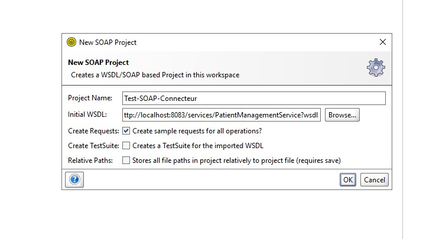
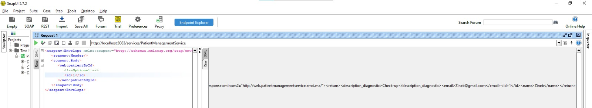
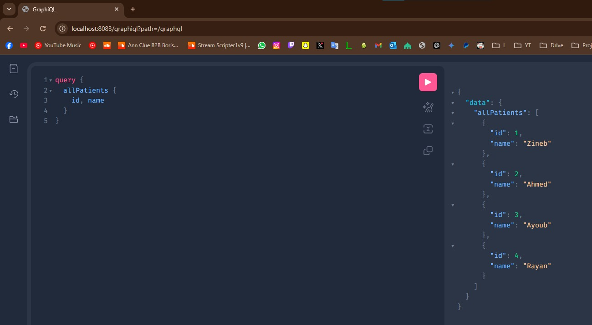
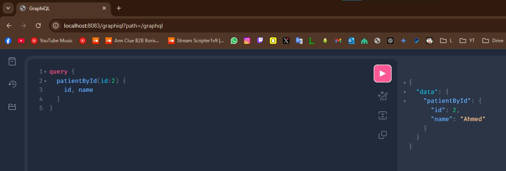
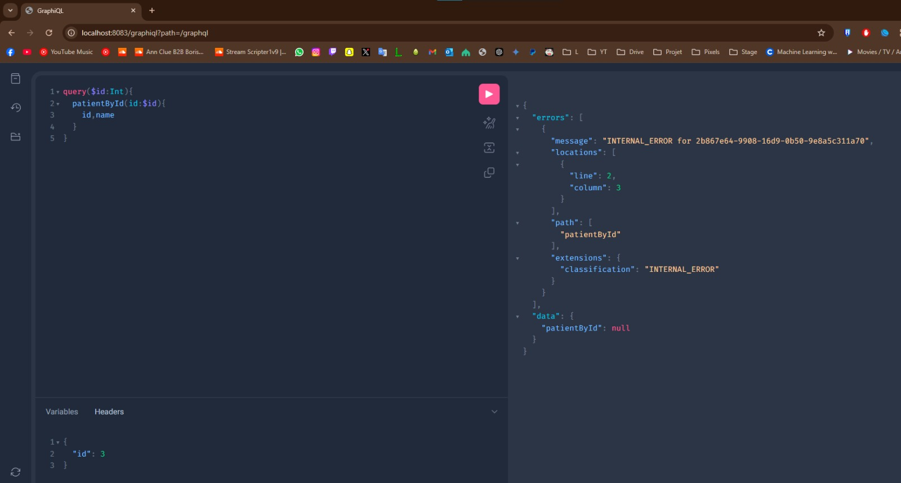
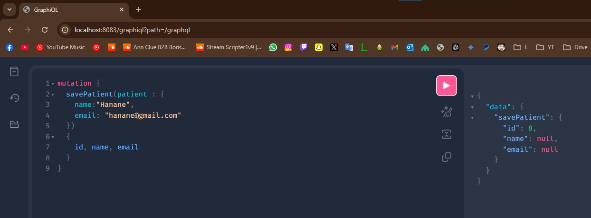
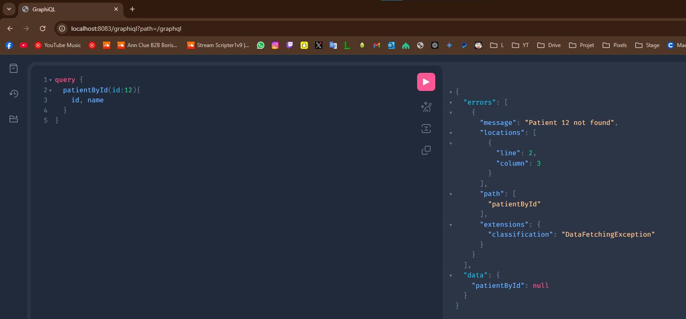
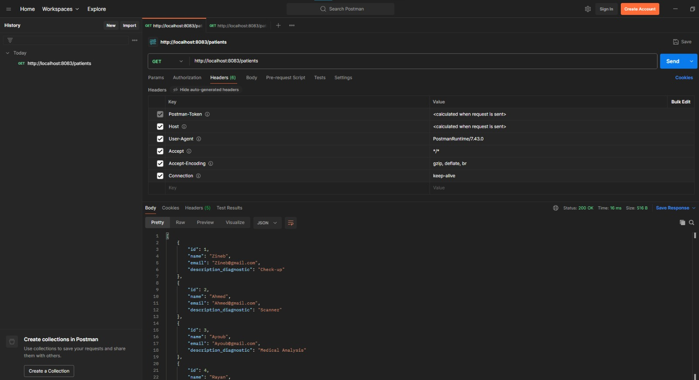

  
    Création d'un projet SOAP pour tester des différentes méthodes exposées
    

  
    Execution d'une requête pour tester la fonction "patientById"
    

  
    Test des méthodes "Query" :
    
    

  
    Test de la méthode "patientById" de type « Query » en utilisant des variables à l’entrée :
    

  
    Test des méthodes de type "Mutation"
    

  
    La raison pour laquelle le message prévu ne s’affiche pas au niveau de la réponse est liée à la manière dont GraphQL et Spring Boot gèrent les exceptions. Par défaut, une exception non gérée, comme la RuntimeException, est interceptée par le mécanisme global de gestion des erreurs de GraphQL, qui masque le message réel de l'erreur pour des raisons de sécurité ou de standardisation.   
    On avait besoin de créer une classe PatientNotFoundException pour gérer l'exception puis l'utiliser dans notre GraphQLController au cas où d'erreur, et pour l'appliquer on a bien créer une classe CustomGraphQLExceptionHandler qui prend comme instance le message d'erreur personnalisé et non le message par défaut.
    

  
    Utilisation de l'outil client "Postman" après accéder à l'API via Swagger
    

